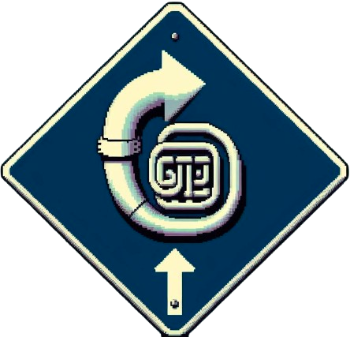
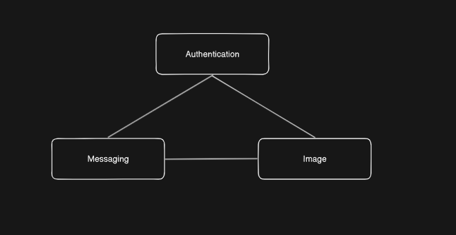

# TUBA

<p align="center">
  
</p>

<p align="center">
  Trace and log runtime errors through a microservices application.
</p>

<p align="center">
  
  
  
  
</p>
<p align="center">
  
  
  
</p>

---
### Features

TUBA is an error parsing package for Express.js and Docker image that work together, allowing you to quickly review and interpret error data in each service over a given range of time.

**Own Your Data**

Have full control of mission-critical historical runtime data in a postgres database you manage.

**Don't Get Lost in the Cloud**

Use the TUBA Interface to visualize your error data in chronological order, highlight any cascades or closely related errors on your Timeline. Review your Heatmap to see errors by service, or search and filter data by keywords. 

**Native Prometheus Integration**

TUBA comes with a suite of custom Prometheus metrics that integrate seamlessly into your existing Prometheus implementation and metrics visualizer.

---
## How to use TUBA
### Express.js

For each individual service in your microservice architecture, include the package in your dependencies:

```Bash
npm i tuba-tracing
```

Now you’re ready to require the package function into the file where Express does your error handling:

```JavaScript
const { tubaMetricRouter } = require('tuba-tracing');
```

The function should be invoked in the Express global error handler, and passed the JavaScript error object and the name of the service/app in which the error occurred:

```JavaScript
// Global Error handler
app.use((err, req, res, next) => {

  // TUBA error metrics and parsing
  tubaMetricRouter(err, 'the name of your service');

  // Your custom error handling for http response
  res.status(500).json({"message": "An error occurred!"});
});
```
You will need to setup/provide your own secure postgres Database. This ensures your data is secure and private.
Create an empty database and place the URI in an .env file. You MUST use TUBA_PG_URI as the proprety key. Ex:

```bash
TUBA_PG_URI='https://postgress.database.link.here.com'
```
Tuba now has access to your database. The database schema should still be unconfigured at this point. This can be done via a simple Postman request that will be covered in the Docker Image section of the docs.

## Prometheus

If you are using Tuba in a Prometheus environment, you can take advantage of the custom Prometheus metrics included in the npm package. 

To use this functionality, include the prom-client package in your dependencies:

```bash
npm i prom-client
```
Then require the dependency in your server routing file:

```JavaScript
const promClient = require('prom-client');
```
Expose `/metrics` in your Express routing to allow Prometheus to scrape the data that TUBA will capture:

```JavaScript
// Expose metrics endpoint for Prometheus to scrape
app.get('/metrics', async (req, res) => {
  res.set('Content-Type', promClient.register.contentType);
  res.send( await promClient.register.metrics());
});
```
For instructions on how to set up prometheus, see the [Prometheus documentation](/https://prometheus.io/).

## Docker

This repo is an exact mirror of the code that runs inside the official TUBA image, and can be run independently as a full-stack application with all the functionality and features of the Docker image. The Tuba interface is run via this Docker image.

The Tuba Docker image can run independently as a standalone container or alongside your microservices images in you application's pre-configured container.

The TUBA Docker image can be downloaded with Docker Desktop or from Docker Hub with this terminal command:

```Bash
docker pull tubatracing/tuba-tracing:latest
```

If you are running Tuba as a standalone container, you’ll need to pass in the link to your postgres database when you start up the image container: 

```Bash
docker run -p [Your Port]:42069 -e TUBA_PG_URI=[Your URI] tubatracing/tuba-tracing:latest
```
Navigte to localhost:[Your Port] to use TUBA

## Microserviced Environment
To use Tuba alongside other images with `docker-compose`, you can add the Docker Hub Tuba image to your `docker-compose` file:
The Tuba image in the below example references a `.env` file that should have the same key value as detailed in the npm package section of these docs:

```YAML
version: "3"
services:
  tuba:
    image: tubatracing/tuba-tracing:latest
    env_file:
      - .env
    ports:
      - "[YOUR PORT]:42069"
  your-other-service:
    build:
      context: ./path/to/your/service
      dockerfile: Dockerfile-your-service
    networks:
      - localnetwork
    ports:
      - 3000:3000
```

## Database Instantiation

The first time you start the TUBA image, the interface should be visible but will stall on the loading screen "Fetching Errors from Database." This is because the database schema hasn't been set yet. To do this, make sure the image is running and send a `GET` request to `http://localhost:[YOUR PORT]/setup/`. Doing so will run this SQL script in your database to create the necessary tables and columns:

```SQL
CREATE TABLE users (
usr_id SERIAL PRIMARY KEY,
usr_name VARCHAR(250) NOT NULL,
usr_password VARCHAR(1000) NOT NULL,
usr_email VARCHAR(500) NOT NULL
);
CREATE TABLE applications (
app_id SERIAL PRIMARY KEY,
app_usr_id INTEGER REFERENCES users (usr_id) NOT NULL,
app_name VARCHAR(500) NOT NULL,
app_kubernetes BOOLEAN NOT NULL
);
CREATE TABLE services (
srv_id SERIAL PRIMARY KEY,
srv_name VARCHAR(500) NOT NULL,
srv_language VARCHAR(250),
srv_usr_id INTEGER REFERENCES users (usr_id) NOT NULL,
srv_app_id INTEGER REFERENCES applications (app_id) NOT NULL
);
CREATE TABLE error_data (
err_id SERIAL PRIMARY KEY,
err_app_id INTEGER REFERENCES applications (app_id) NOT NULL,
err_srv_id INTEGER REFERENCES services (srv_id) NOT NULL,
err_job_name VARCHAR(500) NOT NULL,
err_time BIGINT NOT NULL,
err_message VARCHAR(1000),
err_type VARCHAR(250) NOT NULL,
err_stack VARCHAR(4000) NOT NULL,
err_file_path VARCHAR(2000),
err_file VARCHAR(500),
err_line_num INTEGER,
err_module VARCHAR(500),
err_module_function VARCHAR(500),
err_full_text VARCHAR(2000)
);
CREATE TABLE service_connections (
con_id SERIAL PRIMARY KEY,   
con_srv1 INTEGER REFERENCES services (srv_id) NOT NULL,
con_srv2 INTEGER REFERENCES services (srv_id) NOT NULL
);
```

You will then need to populate the following tables with the relevant data that is unique to your application:
* users
* applications 
* services 
* service_connections 

The `applications` table is the name of your overall application. The `services` table should contain the names of the individual microservices that make up your application. The `services_connections` should contain the connections between microservices. 

For example, if your microservices were connected like in this image: 

<p align="center">
  
</p>

then the relevant columns of your services table would look something like this:

| srv_id | srv_name       |
|--------|----------------|
| 1      | Authentication |
| 2      | Image          |
| 3      | Messaging      |

and the services_connections table would look like this:

| con_id | con_srv1 | con_srv2 |
|--------|----------|----------|
| 1      |  1       | 2        |
| 2      |  1       | 3        |
| 3      |  2       | 3        |


---
### Contributors
| Team Member | LinkedIn | Github |
|-------------|----------|--------|
| **Matthew Allen**  |  [](https://www.linkedin.com/in/matthew-allen-b0611868/) |  [](https://github.com/Allen726) |
| **Emi Knox-Hershey**  | [](https://www.linkedin.com/in/emiknoxhershey/)   | [](https://github.com/emi-kh)  |
| **Myles Austin**  | [](https://www.linkedin.com/in/mylesaustin/)   | [](https://github.com/mtv1243)  |
| **Rick Markowitz**  | [](https://www.linkedin.com/in/rickmarkowitz/)   |  [](https://github.com/rmarkowi1990) |

---
If you found this interesting or helpful, feel free to drop a star on this project!

You can contribute by:
- Raising issues you find in [GitHub Issues](https://github.com/oslabs-beta/LatenSee/issues)
- Fixing issues by opening pull requests
- Improving documentation

In order to run the test suite, you can use the following:

```bash
npm install
npm run test
```
---
### License

TUBA-Tracing is distributed under the MIT License.
